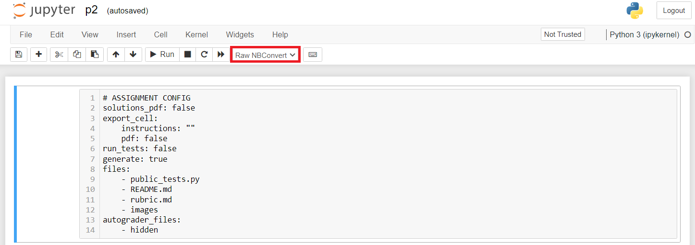

# CS220 Spring 2024 - projectDesign


This repository contains the files used for designing and refreshing CS220
projects for Spring 2024.

## Setup Instructions for TAs and PMs:

1. Clone this repository.
2. Uninstall and reinstall the latest version of Anaconda.
3. Run the Shell command `pip install otter-grader`.

## Setup Instructions for Head TAs:

In addition to the steps above, the Head TAs need to update the keys at the start
of the semester. So, after cloning the repository for the first time, one of the
Head TAs needs to complete the following steps:

1. Set up the Late Day database and create new keys for the GPT API.
2. Update the data in the `otter_tests/keys` directory of this repository.

## Creating Projects:

Creating a brand new project for CS220 is a multi-stage process. The first stage
is **identifying a good dataset** for the project, and writing **scripts** for
gathering the data. The second stage is to **brainstorm questions** based on the
dataset, that **test the learning objectives** of the project. The third stage
is **creating the master notebook** with the **questions** and **solutions**.
The fourth stage is to add in the details about the **public tests** and/or
**hidden tests** to the **master notebook**. The fifth stage is **implementing**
the **hidden tests** in the **hidden tests notebook**. The final stage is
**building** the project to generate the **Gradescope autograder** and the
**student files**.


### Identifying a good dataset:

The most important aspect to deciding on a dataset for a project is determining
whether the dataset will work well with **learning objectives** for the project.
There is no point in selecting a great dataset, if we cannot ask interesting
questions that test the learning objectives of that specific project. However,
before we can select a dataset, we also need to ensure that it meets other
requirements that will make it possible for us to refresh and maintain the
project for future semesters.

CS220 is a data science course that uses **real datasets** for all projects. We
also use **fresh datasets** for all projects. Since we will not be creating new
projects every semester, we will need to ensure that our datasets can be
**updated** easily. We accomplish this by **writing** our own **scripts** for
**scraping** the relevant data from **real-time datasets** hosted on the
internet. This means that we avoid datasets from the usual sources like
*Kaggle*. Instead, it is preferable to find the original source for the data,
and write our own scripts for scraping the data. In short, here are the
requirements we need to satisfy when selecting a dataset for a project:

1. The dataset must pose interesting questions that test the
**learning objectives** of the project, and does **not require** any concepts
not yet covered in lecture.
2. It must be **logical** and **appropriate** to **store** the data in a Python
**data structure** that is relevant for the project.
3. The dataset needs to be from a **reputable source**, that can be cited.
4. The dataset must be **updated in real-time** (or at least in
  **regular intervals**).
5. Ideally, the data must be **hosted** by the **primary source** directly.
6. If not, it must be **hosted** by a **reliable website** that is unlikely
to shut down in the near future.
7. It must be **feasible** to extract the dataset by writing our own
**scripts**.


### Brainstorming questions:

After identifying a good dataset, before scraping the data, it would be a good
idea to **first brainstorm questions, functions, and data structures** for the
project. Depending on what sort of questions need to be asked to test the
**learning objectives**, it may be necessary to **format** the **dataset**
differently, or to **include/exclude some rows or columns of data**.

While brainstorming questions, it will be useful to **refer** to the
**previous version** of the **same project**, and identify the
**learning objectives** being tested in each question. It would be a good idea
to generate questions for the new project that test the same concepts.

### Writing the scripts for scraping the data:

After selecting a good dataset and brainstorming questions, functions, and
data structures, we must **write** the **scripts** for scraping the data.
Based on the questions, identify the minimal the number of columns of data that
we will need. Extra **unnecessary columns** is **not desirable**. Based on the
difficulty level of the project, eliminate some rows of data as well. For
example, for an early project, it may not be a good idea to introduce
**missing data**, and unless it is late into the semester, it may not be a good
idea to introduce **broken data**. For the early projects, we also do not want
datasets that are too large. In all such cases, the data must be **cleaned**,
and the **extra rows** must be **removed** from the dataset.

At this point, it may be a good idea to look at how the other projects scrape
their data. Code in these files can be reused. The scripts for generating the
data must be stored inside a directory named `TA_ONLY` that is stored in the
project directory.

Then execute, the data generation scripts, generate the datasets, and move the
datasets out of the `TA_ONLY` directory into the project directory.

The file structure must look like this:

```
<project>
+-- TA_ONLY
|   +-- <data generation scripts>
+-- <datasets>
```

### Creating the Master Notebook:

After the scripts for generating the datasets are written, and they are used to
generate the datasets used in the project, we are ready to start working on the
master notebook for the project. It is **recommended** that you **create** this
file **from scratch** instead of using a previous project's notebook as a
**template**. This way, we can prevent **references** to other projects from
creeping into the new project.

From Jupyter notebook, create a new notebook in the project directory with the
same filename as the project. For example, if you were creating P5 from scratch,
your file structure at this stage must look like this:

```
p5
+-- TA_ONLY
|   +-- <data generation scripts>
+-- <datasets>
+-- p5.ipynb
```

If you are using a different project's master notebook as a template, you need
to **delete** all code cells with **references** to `public_tests.py`. This can
be done using the script `build_otter_tests.py`. From the Powershell/Terminal,
navigate to this repository, and execute the following command:

```
python build_otter_tests.py <project> -public -delete
```

For example, if you were designing P5, the command would be

```
python build_otter_tests.py p5 -public -delete
```

If you are creating the master notebook from scratch, **you do not need**
**to do this**. Now, open the **master notebook** using Jupyter. You need to
ensure that the very first cell looks like this:



You need to make the cell a `Raw NBConvert` type cell, and ensure that the
cell's contents look as in the image above. You may copy/paste the text below:
```
# ASSIGNMENT CONFIG
solutions_pdf: false
export_cell:
    instructions: ""
    pdf: false
run_tests: false
generate: true
files:
    - public_tests.py
    - README.md
    - rubric.md
    - images
autograder_files:
    - hidden
```
You will have to edit the items under `files`, to include all the files that
need to be provided to students. Note that you cannot include any `.ipynb` files
here, as they will interfere with the Gradescope grader.

After this cell, you will need to include a **code cell** where students enter
their `netid` as a **comment**, followed by **markdown cells** containing the
**title** of the project, the **learning objectives**, as well as **general**
**instructions** for students about testing their code, and **warnings** not to
cheat. These cells can be copied over from an existing project with minimal
changes.

Following these cells, we need to add some **markdown** cells describing the
project, and the dataset used in the project. It will be helpful to display the
first few rows of the data, and to describe what data is stored in each of the
columns, and in what format. It may be useful here to refer to other projects to
get a sense of what information needs to be provided here.

Finally, before starting with the questions, it is **extremely important** to
include a **markdown cell** about the **Project Requirements**. The scripts in
`otter_tests` expect such a cell, and will malfunction if the cell is not there.
This cell **needs** to start with `## Project Requirements:`. The general
requirements about hardcoding, and storing the answer in the correct variable
can be copied over from a different project with minimal changes. However, the
lines after `#### Required Functions:` and `#### Required Data Structures:` need
to be updated.

#### Writing the questions:

After the markdown cells describing the dataset and the project requirements, we
are ready to start writing the questions into the master notebook. To write any
question, function, or data structure, we must create two **Raw NBConvert**
cells as in the image below, and write all text and code in the cells between
those two cells.


The `name` of the question must match the name of the question, function, or
data structure. For example, if the question is `q1`, then the cell must look
like:

```
# BEGIN QUESTION
name: q1
points: 0
```

Similarly, if the function is `foo`, then the cell must look like:

```
# BEGIN QUESTION
name: foo
points: 0
```

It is **extremely important** that the name matches exactly in the case of
functions and data structures, and that in the case of questions, it is of the
format `q<num>`, as the hidden tests rely on the question names being in this
format.

Since the scoring for the projects is handled internally, we must allot
**0 points** to each question, function, and data structure.

Then, the question, function, or data structure's description must be placed in
a **markdown cell** between the two **Raw NBConvert** cells above, as in the
image below.


In the case of a question, it is **important** to ensure that the cell starts
with `**Question <qnum>:**`. In particular, note the placement of the `:`
inside the `**`. After the question, make sure you include any information
relevant to answering the question.

On the other hand, if it is a function, or a data structure, the format of the
markdown cell needs to be as in the images below:


Note that in the case of the function, the function title contains the entire
**signature** of the function, instead of just the name.

#### Writing the solutions:

After writing the questions, we next need to write the solutions in the master
notebook. Since we will be using the same notebook to generate the notebook
that will be provided to students with the answers removed, we need to specify
what parts of the solution should be made visible to the students. To write any
solution, we must create two **Raw NBConvert** cells as in the image below, and
write all the solution code in the cells between those two cells.


These `SOLUTION` tags must appear inside the `QUESTION tags`, **below** the
**markdown cells** that contain the question, function, or data structure. In
particular, any markdown cell that appears after the `# BEGIN SOLUTION` cell
within a question will not be displayed to students, so all **markdown cells**
must appear **before** the `# BEGIN SOLUTION` cell.

Between the `# BEGIN SOLUTION` and `# END SOLUTION` tags, we can insert
**code cells** that contain the solution to the question. The simplest thing
to do would be to make the solution visible to the students. That can be
done by just writing the solution directly, as in the example below:


When we generate the student version of the project notebook later, this cell
will be displayed exactly as above:
```python
# we have done this one for you
course_name = 'CS220'

course_name
```

If we wish to **hide** the **assigned value**, but **not the variable name** in
the first line here, we would have to follow the example below:


When we generate the student version of the project notebook later, this cell
will replace the code following the `=` in the line that contains the comment
`# SOLUTION` with `...` in the solution notebook as below:
```python
# replace the ... with your code
course_name = ...

course_name
```

Finally, if we wish to **hide** an entire line of code, we would have to follow
the example below:


When we generate the student version of the project notebook later, this cell
will simply delete the entire line that contains the comment
`# SOLUTION NO PROMPT` as below:
```python
# compute and store the answer in the variable 'course_name', then display it

```

We can combine the `# SOLUTION` and `# SOLUTION NO PROPMT` tags within a single
solution code cell. For example, if we write the following code in the master
notebook:
```python
# replace the ... with your code, then display the variable 'course_name'
course_name = 'CS220' # SOLUTION

course_name # SOLUTION NO PROMPT
```

then, when we generate the student version of the project notebook, this cell
will be transformed into:
```python
# replace the ... with your code, then display the variable 'course_name'
course_name = ...

```

If we need to hide multiple lines of code, it would be tedious to type
`# SOLUTION NO PROMPT` after each line. Instead, we can do something like this:
```python
# compute and store the answer in the variable 'course_name', then display it

# BEGIN SOLUTION NO PROMPT
course_name = 'CS220'

course_name
# END SOLUTION
```

This has the same effect as typing `# SOLUTION NO PROMPT` at the end of each
line inside the `# BEGIN SOLUTION NO PROMPT` and `# END SOLUTION` comment lines.
Similarly, multiple `# SOLUTION` lines can be replaced by placing them inside
`# BEGIN SOLUTION` and `# END SOLUTION` lines.

Finally, it is sometimes necessary to display **incorrect** code to the students
and ask them to fix it. In such cases, we can use the `PROMPT` tags as in the
example below:
```python
# fix the error in the code below
course_name = 'CS'
"""# BEGIN PROMPT
course_name += 220
""";# END PROMPT
# BEGIN SOLUTION NO PROMPT
course_name += '220'
# END SOLUTION

course_name
```

When we generate the student version of the project notebook, the first line
will be copied over exactly as it is. Then, the code inside the `# BEGIN PROMPT`
and `# END PROMPT` tags will be copied as regular code into the student version.
The next line of code is inside the `# BEGIN SOLUTION NO PROMPT` and
`# END SOLUTION` tags, so it will be hidden in the student version, and the
final line will again be copied over as it is. In effect, the above cell will be
transformed into the following cell in the student version of the project:
```python
# fix the error in the code below
course_name = 'CS'
course_name += 220

course_name
```

Using the `SOLUTION`, `SOLUTION NO PROMPT`, and `PROMPT` tags, all solutions can
be written into the **master notebook** such that the **student version** will
only display the code that we want displayed there.

### Writing details for the public and hidden tests:

After writing all questions, functions, data structures, and solutions into the
**master notebook**, we are ready to start working on the **tests**. The labs
will only have **public tests**, but the projects (except for P1) will have both
**public** and **hidden tests**.

Just like with the solutions, we must write the **tests** inside two
**Raw NBConvert** cells, as in the example below:


These `TESTS` tags must appear inside the `QUESTION tags`, **below** the
`# END SOLUTION` cell.

#### Writing public tests:

The public tests are **not** to be written **directly** into **code cells**.
Instead, we will enter all the relevant data into a **markdown cell**, and use
the scripts in `otter_tests` to generate the necessary code cells, as well as
the `public_tests.py` file.

The markdown cell needs to be in the following format:
```
## IGNORE ##

#### Public Test

**points:** <points>

**format:** <answer_format>

**answer:** <answer>

**question:** <question>
```

The first line (`## IGNORE ##`) will be used by our scripts in `otter_tests` to
detect that this markdown cell contains information that must not be displayed
to students, and will therefore hide this cell from the student version.

The second line (`#### Public Test`) tells us that this cell contains details
about a **public test**. The third line (`**points: <points>`) tells us how many
points this question, function, or data structure is worth.

In the case of a function, or data structure, where there is no explicit public
test associated with it, no additional details need to be provided. So, for
example, in the case of the function `foo`, the public test details can be:
```
## IGNORE ##

#### Public Test

**points:** 2
```

On some occasions, we may have a **required function**, or
**required data structure** that does not have any **points** allotted to it.
This may be because the function, or data structure was already defined in a
previous project, or lab. In such instances, we **cannot** define a
**public test** for that function, or data structure. Instead, we define a
**dummy test** as in the example below:
```
## IGNORE ##

#### Dummy Test

**points:** 0
```

A **dummy test** will always pass, and will not offer any points, but will be
useful, as it can be used to identify the location on the student's notebook
where the function, or data structure is defined.

Now, we will move back to the questions which have a public test. For these
questions, we will need to provide additional details. The various accepted
choices for the `format` are:

* TEXT_FORMAT: when the expected output is a `type`, `NoneType`, `bool`,
`int`, `float`, or `str`,
* TEXT_FORMAT_UNORDERED_LIST:  when the expected output is a `list` or a `set`
where the order does *not* matter,
* TEXT_FORMAT_ORDERED_LIST: when the expected output is a `list` or `tuple`
where the order **does** matter,
* TEXT_FORMAT_SPECIAL_ORDERED_LIST:  when the expected answer is a list where
order does matter, but with possible ties,
* TEXT_FORMAT_DICT: when the expected output is a `dict`,
* TEXT_FORMAT_NAMEDTUPLE: when the expected output is a `namedtuple`,
* HTML_FORMAT_ORDERED: when the expected answer is a `DataFrame` and the order
of the indices matter,
* HTML_FORMAT_UNORDERED: when the expected answer is a `DataFrame` and the order
of the indices does not matter,
* TEXT_FORMAT_SLASHES: when the expected output is a `str` which contains file
paths,
* TEXT_FORMAT_UNORDERED_LIST_SLASHES: when the expected output is an unordered
`list` of file paths,
* TEXT_FORMAT_ORDERED_LIST_SLASHES: when the expected output is an ordered
`list` of file paths.

After selecting the appropriate **format** for the question, the **answer** is
simply the **variable** that is expected to contain the correct answer to that
question, as in the example below:


Later when we run the scripts in `otter_tests`, we will read this markdown cell,
and use this data to find the value of the variable `course_name` after the
execution of the solution cell, and store that in `public_tests.py` under the
format `TEXT_FORMAT`.

The **question** is an *optional* attribute that **must** be provided in cases
where the **variable** that stores the answer is different from the variable
that needs to be tested. This happens in the case where the **format** is
`TEXT_FORMAT_SPECIAL_ORDERED_LIST`. This format is used in cases where the
output needs to be ordered, but needs to account for possible ties. For example,
if the question is to **sort** the **list** `[1, 2, -1]` by the
**absolute values** of the elements, then both `[1, -1, 2]` and `[-1, 1, 2]` are
valid answers. In that case, it is not sufficient to represent the variable
containing the answer as the **answer** to this question, as students can
potentially get a different correct answer to that question, and be marked
incorrect. The `TEXT_FORMAT_SPECIAL_ORDERED_LIST` **format** works around this
by storing not just the elements of the ordered list, but the value by which
they are sorted. For example, in the example above, the **answer** needs to be
stored as `[(1, 1), (-1, 1), (2, 2)]`. The first element of each tuple is the
actual element of the list, and the second element is the value by which it is
ordered. Then using this data, `public_tests.py` will be able to grade all
answers correctly. However, we do **not** actually want students to store the
list `[(1, 1), (-1, 1), (2, 2)]` as their answer, but just the sorted list
`[1, -1, 2]` or `[-1, 1, 2]`. In this case, we use the optional **question**
attribute to store the variable defined by the students that is actually being
tested.

Summing up, when the **format** is `TEXT_FORMAT_SPECIAL_ORDERED_LIST`, the test
details need to look like this:
```
## IGNORE ##

#### Public Test

**points:** 2

**format:** TEXT_FORMAT_SPECIAL_ORDERED_LIST

**answer:** [(elmt, abs(elmt)) for elmt in sorted_list]

**question:** sorted_list
```

Then, the notebook will test the value stored in **question**, but
`public_tests.py` will use the data in **answer** to execute the tests.
The optional **question** attribute must also be used when the **format** is
some type of `HTML_FORMAT`. In that case, the **answer** needs to be converted
from a `DataFrame` into HTML text using the `.to_html()` method, however, the
**question** must remain as a `DataFrame`. For example, it would look something
like this:
```
## IGNORE ##

#### Public Test

**points:** 5

**format:** HTML_FORMAT_ORDERED

**answer:** example_dataframe.to_html()

**question:** example_dataframe
```

#### Writing hidden tests:

After writing public tests for all the questions, we must write the details for
the hidden tests for the projects. Note that the hidden tests are unnecessary
for the labs, and **this entire section can be skipped**.

In case hidden tests do need to be created, we will need two additional
questions at the very end of the project to track **general deductions**, and
to provide a **summary** of deductions to students on Gradescope. So, the
following **Raw NBConvert** cells will need to be added to the end of the
**master notebook**:


All the actual code for the hidden tests will be **generated using GPT-4**.
Therefore, at this stage, our goal is to write text describing why each rubric
point exists, and how we should go about testing it, in **plain English**.
Our first order of business is to explain how to generate **random datasets**
that contain **fake data** in exactly the **same format** as the **real data**.
A lot of the hidden tests will require us to create completely random data, so
we will need to create functions that can generate such random data. Therefore,
we need to **describe the format of the data**, so it can be used by GPT to
generate more fake data.

This is done at the very start of the **master notebook**, after the Project
Description. New **markdown cells** must be added before the **Project**
**Requirements** describing the format of the data. All of these cells must
start with the lines:

```
## IGNORE ##

## Instructions for Random Data Generation:
```

It may be useful to refer to other projects to see what sort of instructions
need to be provided in these cells.

After describing the format of the data, sometimes it might also be
**necessary** to ensure that **specific data** is always **present** in the
dataset. For example, if the dataset for a project is the
**list of all students in CS220**, and Question 1 in the project wants to find
the **index of a particular student**, then we need to **make sure** that the
**fake data** we generate **contains this particular student**. To do that,
we create a separate **markdown cell** between the `# BEGIN QUESTION` and
`# END QUESTION` cells of this question, between the `# END SOLUTION` and
`# BEGIN TESTS` cells. In this cell, we describe the specific data that must
be in the fake data. All of these cells must start with the lines:

```
## IGNORE ##

#### Requirements for Random Data Generation:
```

After describing how the random data needs to be generated, we are now ready
to write down the rubric for the project, and to describe how their tests must
be generated. The first task is to come up with a **rubric** for the project.
For each question, function, and data structure, we must **identify**
**common errors** that students might make, and come up with a rubric item for
each such error. We must allot **points** to each such **rubric item**.
At this stage, we need to ensure that the **total points** allotted to all
**hidden tests** within a question **does not exceed** the **points** allotted
to its **public test**. If the total points allotted to the **hidden tests** is
**less** than the points allotted to the **public test**, then the remaining
points will be granted to the student as long as they pass the public test. They
will get the other points, only if they meet the criterion laid out by the
rubric items. In the case of **functions and **data structures**, which do not
have any public tests, we need to ensure that the **total points** allotted to
all the **hidden tests** is **exactly equal** to the **points** allotted to the
**public test**. Otherwise, the students will just receive the remaining points
for free points, even if they do nothing.

After **framing the rubric**, the details for the **hidden tests** need to be
written to the **master notebook**. Each **rubric item** gets its own
**hidden test**, and must be expressed in a **markdown cell** below the
**public test** cell for that question.

The markdown cell needs to be in the following format:
```
## IGNORE ##

#### Hidden Test

**rubric item:** <rubric_item>

**points:** <points>

**reason for rubric:** <reason_for_rubric>

**test dataset details:** <test_dataset_details>

**test notebook details:** <test_notebook_details>
```

The attributes **rubric item**, and **points** are self-explanatory. The
**reason for rubric** attribute needs to be provided, so that students get a
**useful error message** when they fail the hidden tests. The details provided
in this attribute are used by GPT to write the error messages that explain what
students need to do, to fix their code and pass the test. The
**test dataset details** and **test notebook details** attributes are optional
attributes used to store details on how the **dataset** and the **notebook**
respectively must be modified to execute the **hidden test** associated with
this rubric item.

Here are some examples:


After creating the **markdown cells** for the question-specific rubric items,
the last thing left to do is to create **markdown cells** for the general
deductions. These cells can be added inside the `general_deductions`
question, just as we did with the other questions.

### Implementing the hidden tests:

After writing the questions, solutions, and test markdown cells into the
**master notebook**, we have finished all the work that needs to be done on
the master notebook. We can now generate the test code cells in the notebook,
as well as the `public_tests.py` file by running the following command from
the Powershell/Terminal window:

```
python build_otter_tests.py <project> -public
```

After generating the public tests, if we want to generate hidden tests for the
project, we need to run the command:

```
python build_otter_tests.py <project> -hidden
```

This will create a directory called `sandbox`, which will contain the files we
will need to implement our hidden tests. The file structure at this stage must
look like this:

```
<project>
+-- TA_ONLY
|   +-- <data generation scripts>
+-- <datasets>
+-- <project>.ipynb
+-- sandbox
|   +-- autograder
|   |   +-- <datasets>
|   |   +-- <project>.ipynb
|   |   +-- hidden
|   |   |   +-- hidden_tests.ipynb
|   |   |   +-- <other files>
|   |   +-- <other files>
|   +-- student
|   |   +-- <other files>
```

The hidden tests will all be written in the file
`<project>\sandbox\autograder\hidden\hidden_tests.ipynb` instead of the
**master notebook**. We will call this notebook the **tests notebook**.
Open up the **tests notebook** first. The first thing to do is to **verify**
that the function and data structure **dependencies** are correct, and that
the definitions of the **functions** and **data structures** in the sections
`True Functions` and `True Data Structures` are correct.

Then, we will need to use GPT to generate the function used for generating the
random data. This can be accomplished with the command:

```
python build_otter_tests.py <project> -hidden -write -random
```

After running the command, **refresh** the **tests notebook**, go to the
`Random Data Generation` section of the **tests notebook**. The function
`random_data` generated there is the most complicated function that we will
generate in this file, and this function is likely to have several bugs in it.
Fix the bugs in the function definition, and ensure that the additional
requirements for the functions described in the markdown cell are also met.

Then, we may start generating the hidden tests for the rubric items. It is
advisable to generate the rubric items one by one, instead of all at once.
To generate the tests for the next rubric item in the **tests notebook**, the
following command must be executed:

```
python build_otter_tests.py <project> -hidden -write -next
```

After generating each test, **refresh** the **tests notebook** (without
**saving** the file accidentally!). Debug the code generated for the test, and
repeat for all other rubric items.

After the hidden tests have all been generated, Restart and Run all Cells in the
**tests notebook**. Fix any bugs that appear.

### Building the project:

After the hidden tests have all been implemented, it would be a good idea to
refresh the **hidden tests**. To do this, the **tests notebook** as well as
any other notebook in the `sandbox` directory that is open must be **shut down**
on Jupyter. Then, the following command must be executed:

```
python build_otter_tests.py <project> -hidden -refresh -data
```

This command will refresh all the data files in the `sandbox/autograder/hidden`
directory. Then, reopen the **tests notebook**, and Run all Cells again.

After the cells are finished running, the project is ready to be built. Execute
the following command:

```
python build_otter_tests.py <project> -build
```

After the command is executed, the file structure must look like this:

```
<project>
+-- TA_ONLY
|   +-- <data generation scripts>
+-- <datasets>
+-- <project>.ipynb
+-- sandbox
|   +-- autograder
|   |   +-- <datasets>
|   |   +-- <project>.ipynb
|   |   +-- hidden
|   |   |   +-- hidden_tests.ipynb
|   |   |   +-- <other files>
|   |   +-- <other files>
|   +-- student
|   |   +-- <other files>
+-- project
|   +-- autograder
|   |   +-- <datasets>
|   |   +-- <project>.ipynb
|   |   +-- hidden
|   |   |   +-- hidden_tests.ipynb
|   |   |   +-- <other files>
|   |   +-- <gradescope_autograder>.zip
|   |   +-- <other files>
|   +-- student
|   |   +-- <other files>
```

To confirm that the hidden tests work correctly, open the file
`project/autograder/<project>.ipynb`, and Run all Cells. If any of the tests
fail, that indicates that there is an error in the **tests notebook**, and
all the steps in this stage must be repeated, after the bug is fixed.

#### Testing the project:

If all the tests pass, then each rubric item must be **individually tested**.
This must be done in the `sandbox` directory. The file
`sandbox/autograder/<project>.ipynb` must be opened. For each rubric item
associated with each question, the following steps need to be followed to test:

1. The solution must be modified in several different ways so that it is
logically still correct, but is written differently.
2. For each such solution, the notebook must be saved, then the cells containing
the code `public_tests.reset_hidden_tests()` and `grader.check('<question>')`
below that question must be executed.
3. It must be confirmed that the question still passes the test with this
correct code.
4. Finally, the solution must be modified so that it outputs the correct answer,
but violates the rubric item being tested.
5. When the cells from above are executed again, this time, the tests must fail.

If the tests **fail** for any **correct implementation**, or **pass** for any
**incorrect implementation**, there is a **bug** in the **tests notebook**,
that must be fixed.

#### Deploying the project:

After the project has been sufficiently tested, to deploy it, the files inside
`project/student` must be moved over to the public repository. The file
`project/autograder/<gradescope_autograder>.zip` is the Gradescope autograder,
and it must be **built** on the Gradescope assignment.

## Refreshing Projects:

If the project does not have to be created from scratch, but instead just
refreshed, it is significantly easier. Here are the steps that need to be
followed to refresh a project:

1. Run the data generation scripts in the `TA_ONLY` directory to refresh the
datasets.
2. Open the **master notebook**, and update any questions that are no longer
relevant after the data update.
3. Verify that any information provided to the students about the dataset is
true after the dataset update. For example, if the notebook claims that the
dataset contains *100* rows, find the number of rows in the new dataset, and
update the value. Similarly, if the notebook claims that there is are *15* names
in the dataset that begin with the letter `'A'`, or that there is a unique
longest name in the dataset, confirm these facts, and if necessary, update them.
4. Replace some questions to keep the project a little fresh.
5. Update the solutions to any questions that were changed.
6. Update the test descriptions for the rubric items in the **markdown cells**
if necessary. If a question is replaced completely, create new rubric items
for these questions, and write their **test details** in the **markdown cells**.
7. After updating the **master notebook**, run the command
`python build_otter_tests.py <project> -public` to refresh `public_tests.py`,
`rubric.md`, and `answers.json`.
8. Then execute the command
`python build_otter_tests.py <project> -hidden -refresh -all` to refresh all
the files in the `sandbox` directory.
9. Make adjustments to the definition of the function `random_data`, so that it
is in the format of the new dataset, and meets the requirements for the new
questions.
10. If any new rubric items were introduced to the project, open the
**tests notebook**, and execute the command
`python build_otter_tests.py <project> -hidden -write -next` repeatedly to
generate hidden tests for the new rubric items.
11. Fix all links in the **master notebook** and the **README** file.
12. Build the new project with the command
`python build_otter_tests.py <project> -build`.
