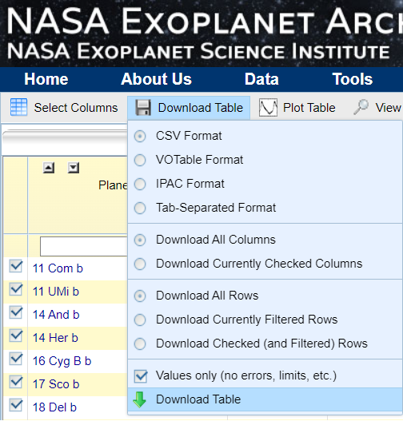

## **TA ONLY**

The files here are for TA use only. Do not upload to the main repo.

### **Instructions to use:**

- The raw dataset was extracted from: https://exoplanetarchive.ipac.caltech.edu/index.html
- From the Home Page, go to `Data --> Planetary Systems Composite Data`. Alternately, go to the link: https://exoplanetarchive.ipac.caltech.edu/cgi-bin/TblView/nph-tblView?app=ExoTbls&config=PSCompPars

- From the page, select `Download All Columns`, `Download All Rows`, and `Values only (no errors, limits, etc.)` as in the image here:

    

- Store this data as `nasa_raw.csv` in this directory.

- Then run all cells in `unbroken_data_gen.ipynb`. The directory `unbroken_data` is created with all the files split up.

- Then run all cells in `broken_data_gen.ipynb`. The directories `data` and `broken_data` are created with all the files split up.

- The necessary files `data.zip` and `broken_data.zip` are also created by zipping these directories.
