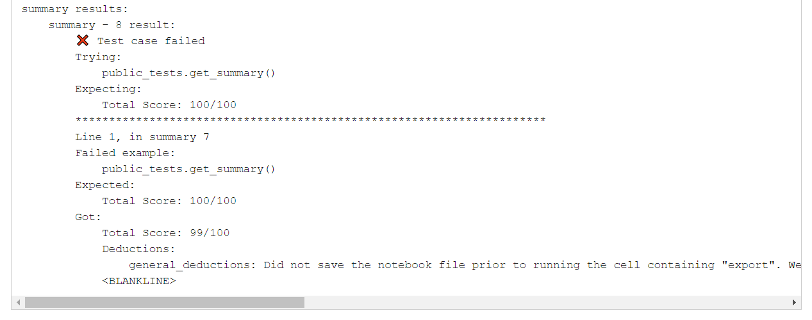

# Project 10 (P10): Looking at Stars and Planets

## Corrections and clarifications:

* None yet.

**Find any issues?** Report to us:

- Jane Zhang <zhang2752@wisc.edu>
- Abhinav Harish <aharish2@wisc.edu>

## Instructions:

This project will focus on **file handling**, **namedtuples**, **data cleaning** and **error handling**. To start, download [`p10.ipynb`](https://git.doit.wisc.edu/cdis/cs/courses/cs220/cs220-s24-projects/-/tree/main/p10/p10.ipynb), [`public_tests.py`](https://git.doit.wisc.edu/cdis/cs/courses/cs220/cs220-s24-projects/-/tree/main/p10/public_tests.py), and [`data.zip`](https://git.doit.wisc.edu/cdis/cs/courses/cs220/cs220-s24-projects/-/tree/main/p10/data.zip).

After downloading `data.zip`, make sure to extract it (using [Mac directions](http://osxdaily.com/2017/11/05/how-open-zip-file-mac/) or [Windows directions](https://support.microsoft.com/en-us/help/4028088/windows-zip-and-unzip-files)). After extracting, you should see a folder called `data`, which has the following files in it:

* `.DS_Store`
* `.ipynb_checkpoints`
* `mapping_1.json`
* `mapping_2.json`
* `mapping_3.json`
* `mapping_4.json`
* `mapping_5.json`
* `stars_1.csv`
* `stars_2.csv`
* `stars_3.csv`
* `stars_4.csv`
* `stars_5.csv`
* `planets_1.csv`
* `planets_2.csv`
* `planets_3.csv`
* `planets_4.csv`
* `planets_5.csv`

You may delete `data.zip` after extracting these files from it.

You will work on `p10.ipynb` and hand it in. You should follow the provided directions for each question. Questions have **specific** directions on what **to do** and what **not to do**.

**Important warning:** Since P10 deals heavily with file handling, whether or not the test cases pass depends greatly on the operating system being used. Even if your code passes all tests locally, it may **fail on Gradescope** if it uses a different operating system. To avoid these issues, **follow the instructions** in P10 carefully, and **after submission, check to see that all your test cases pass on the Gradescope autograder**.

------------------------------

## IMPORTANT Submission instructions:
- Review the [Grading Rubric](https://git.doit.wisc.edu/cdis/cs/courses/cs220/cs220-s24-projects/-/tree/main/p10/rubric.md), to ensure that you don't lose points during code review.
- Login to [Gradescope](https://www.gradescope.com/) and upload the zip file into the P10 assignment.
- If you completed the project with a **partner**, make sure to **add their name** by clicking "Add Group Member"
in Gradescope when uploading the P10 zip file.

   

   **Warning:** You will have to add your partner on Gradescope even if you have filled out this information in your `p10.ipynb` notebook.

- It is **your responsibility** to make sure that your project clears auto-grader tests on the Gradescope test system. Otter test results should be available within forty minutes after your submission (usually within ten minutes). **Ignore** the `-/100.00` that is displayed to the right. You should be able to see both PASS / FAIL results for the 20 test cases, which is accessible via Gradescope Dashboard (as in the image below):

    

- You can view your **final score** at the **end of the page**. If you pass all tests, then you will receive **full points** for the project. Otherwise, you can see your final score in the **summary** section of the test results (as in the image below):

   

   If you want more details on why you lost points on a particular test, you can scroll up to find more details about the test.
