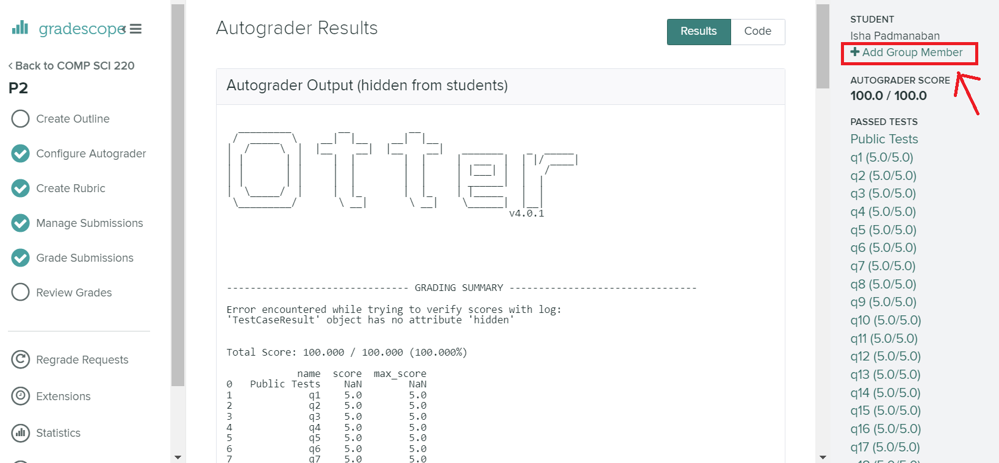

# Project 11 (P11): Analyzing Stars and Planets


## Corrections and clarifications:

* None yet.

**Find any issues?** Report to us:

- Yunfu Deng <yunfu.deng@wisc.edu>
- Jane Zhang <zhang2752@wisc.edu>


## Instructions:

This project will focus on **data analysis**, **creating scatter plots**, and **recursion**. In this project, you will continue from where you left off in P10. You will analyze the data structures you created in P10 to answer some interesting questions about our dataset.

To start, download [`p11.ipynb`](https://git.doit.wisc.edu/cdis/cs/courses/cs220/cs220-s24-projects/-/tree/main/p11/p11.ipynb), [`public_tests.py`](https://git.doit.wisc.edu/cdis/cs/courses/cs220/cs220-s24-projects/-/tree/main/p11/public_tests.py), [`expected_plots.json`](https://git.doit.wisc.edu/cdis/cs/courses/cs220/cs220-s24-projects/-/tree/main/p11/expected_plots.json), and [`broken_data.zip`](https://git.doit.wisc.edu/cdis/cs/courses/cs220/cs220-s24-projects/-/tree/main/p11/broken_data.zip).

<span style="color:red">If it takes too long to load the file `expected_plots.json` on GitLab, you can directly download the file from this link:</span> [`expected_plots.json`](https://git.doit.wisc.edu/cdis/cs/courses/cs220/cs220-s24-projects/-/raw/main/p11/expected_plots.json). You will need to **Right Click**, and click on the **Save as...** button to save the file through this method.

After downloading `broken_data.zip`, make sure to extract it (using [Mac directions](http://osxdaily.com/2017/11/05/how-open-zip-file-mac/) or [Windows directions](https://support.microsoft.com/en-us/help/4028088/windows-zip-and-unzip-files)). After extracting, you should see a folder called `broken_data`. You may delete `broken_data.zip` after extracting the files inside it.

You may also download [`data.zip`](https://git.doit.wisc.edu/cdis/cs/courses/cs220/cs220-s24-projects/-/tree/main/p11/data.zip) and extract it. Alternatively, you could also copy/paste the `data` directory that you worked with in P10 into your P11 directory.

**Important**: You **must** make sure that your file structure looks like this:

```
+-- p11.ipynb
+-- public_tests.py
+-- expected_plots.json
+-- data
|   +-- .DS_Store
|   +-- .ipynb_checkpoints
|   +-- mapping_1.json
|   +-- mapping_2.json
|   +-- mapping_3.json
|   +-- mapping_4.json
|   +-- mapping_5.json
|   +-- planets_1.csv
|   +-- planets_2.csv
|   +-- planets_3.csv
|   +-- planets_4.csv
|   +-- planets_5.csv
|   +-- stars_1.csv
|   +-- stars_2.csv
|   +-- stars_3.csv
|   +-- stars_4.csv
|   +-- stars_5.csv
+-- broken_data
|   +-- .DS_Store
|   +-- hd
|   |   +-- 10000
|   |   |   +-- .ipynb_checkpoints
|   |   |   +-- .DS_Store
|   |   |   +-- 10000s.json
|   |   +-- others.json
|   +-- k2s.json
|   +-- kepler
|   |   +-- 10
|   |   |   +-- .DS_Store
|   |   |   +-- 30
|   |   |   |   +-- .ipynb_checkpoints
|   |   |   |   +-- .DS_Store
|   |   |   |   +-- 30s.json
|   |   |   +-- other
|   |   |   |   +-- others.json
|   |   |   +-- 20s.json
|   |   |   +-- 80s.json
|   |   +-- 100
|   |   |   +-- 100
|   |   |   |   +-- other
|   |   |   |   |   +-- .ipynb_checkpoints
|   |   |   |   |   +-- .DS_Store
|   |   |   |   |   +-- others.json
|   |   |   |   +-- 100s.json
|   |   |   +-- 200
|   |   |   |   +-- 220
|   |   |   |   |   +-- 220s.json
|   |   |   |   +-- 290
|   |   |   |   |   +-- 290s.json
|   |   |   |   +-- other
|   |   |   |   |   +-- .ipynb_checkpoints
|   |   |   |   |   +-- .DS_Store
|   |   |   |   |   +-- others.json
|   |   |   +-- others.json
|   |   +-- other
|   |   |   +-- .ipynb_checkpoints
|   |   |   +-- others.json
|   +-- others.json
|   +-- toi
|   |   +-- .ipynb_checkpoints
|   |   +-- tois.json
```

Otherwise, your code may pass on **your computer**, but **fail** on the testing computer.

You will work on `p11.ipynb` and hand it in. You should follow the provided directions for each question. Questions have **specific** directions on what **to do** and what **not to do**.

------------------------------

## IMPORTANT Submission instructions:
- Review the [Grading Rubric](https://git.doit.wisc.edu/cdis/cs/courses/cs220/cs220-s24-projects/-/tree/main/p11/rubric.md), to ensure that you don't lose points during code review.
- Login to [Gradescope](https://www.gradescope.com/) and upload the zip file into the P11 assignment.
- If you completed the project with a **partner**, make sure to **add their name** by clicking "Add Group Member"
in Gradescope when uploading the P11 zip file.

   

   **Warning:** You will have to add your partner on Gradescope even if you have filled out this information in your `p11.ipynb` notebook.

- It is **your responsibility** to make sure that your project clears auto-grader tests on the Gradescope test system. Otter test results should be available within forty minutes after your submission (usually within ten minutes). **Ignore** the `-/100.00` that is displayed to the right. You should be able to see both PASS / FAIL results for the 20 test cases, which is accessible via Gradescope Dashboard (as in the image below):

    

- You can view your **final score** at the **end of the påage**. If you pass all tests, then you will receive **full points** for the project. Otherwise, you can see your final score in the **summary** section of the test results (as in the image below):

   

   If you want more details on why you lost points on a particular test, you can scroll up to find more details about the test.
